<!DOCTYPE html>
<html lang="en">
<head>
    <meta charset="UTF-8">
    <meta name="viewport" content="width=device-width, initial-scale=1.0">
    
</head>
<Body>

<header>
    <h1>Taller 10 - David Santiago López Orozco</h1> 
    <h2>Curso: Full Stack Básico - Grupo 1</h2>
    <h2>Profesor: Cristian patiño</h2>
</header>

<main> 

<h3>Punto 1 : Formulario de operaciones para el usuario</h3>
<a href="../Php_Structure_Taller_10/folio-1/indexv1.php">Punto 1 : Formulario de operaciones para el usuario</a>  
<h3>Imágen de la interfaz operadora</h3>
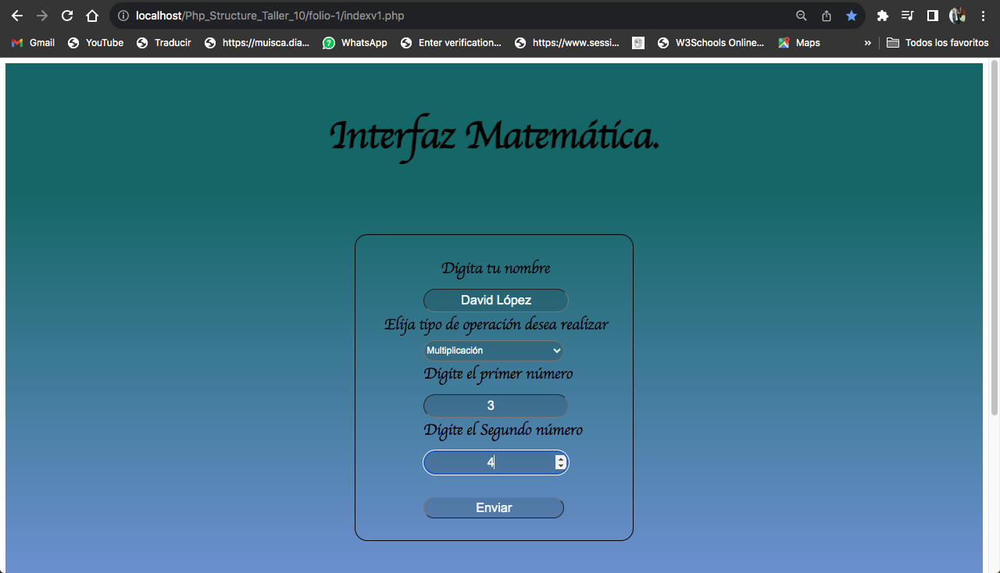</img>  
<h3>Resultado de la interfaz operadora</h3>
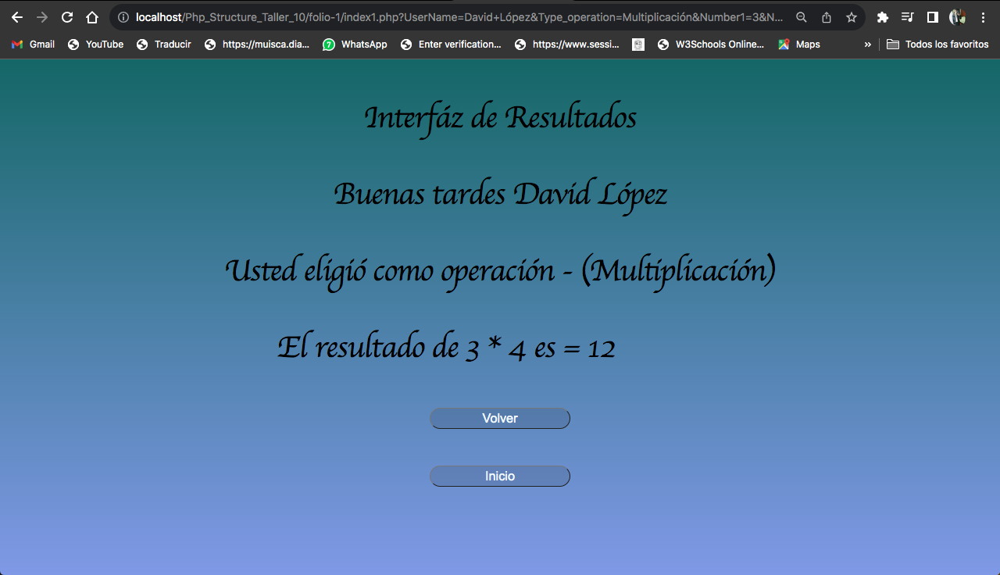</img>  

<h3>Punto 2 : Solicitud de Edad al usuario</h3>
<a href="./folio-2/index2.php">Punto 2 : Solicitud de Edad al usuario</a>  
<h3>Imágen de la interfaz de edades</h3>
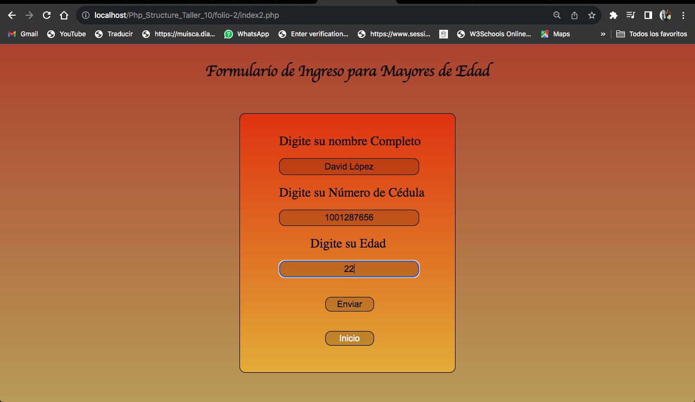</img>  
<h3>Resultado de la interfaz de edades</h3>
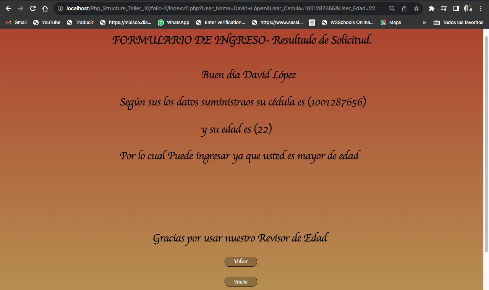</img>  

<h3>Punto 3 : Captura de datos por método GET</h3>
<a href="./folio-3/indexv3.php">Punto 3 : Captura de datos por método GET</a>  
<h3>Imágen de la interfaz de captura de datos por método GET</h3>
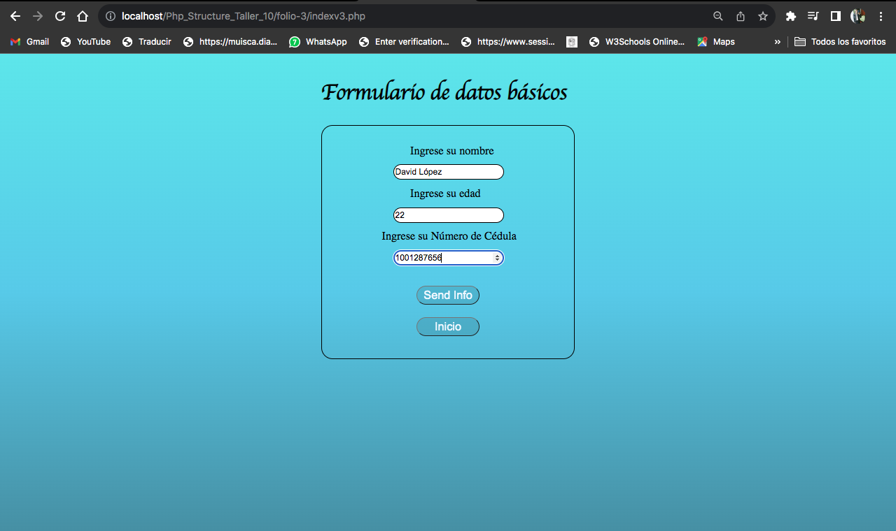</img>  
<h3>Resultado de la interfaz de captura de datos por método GET</h3>
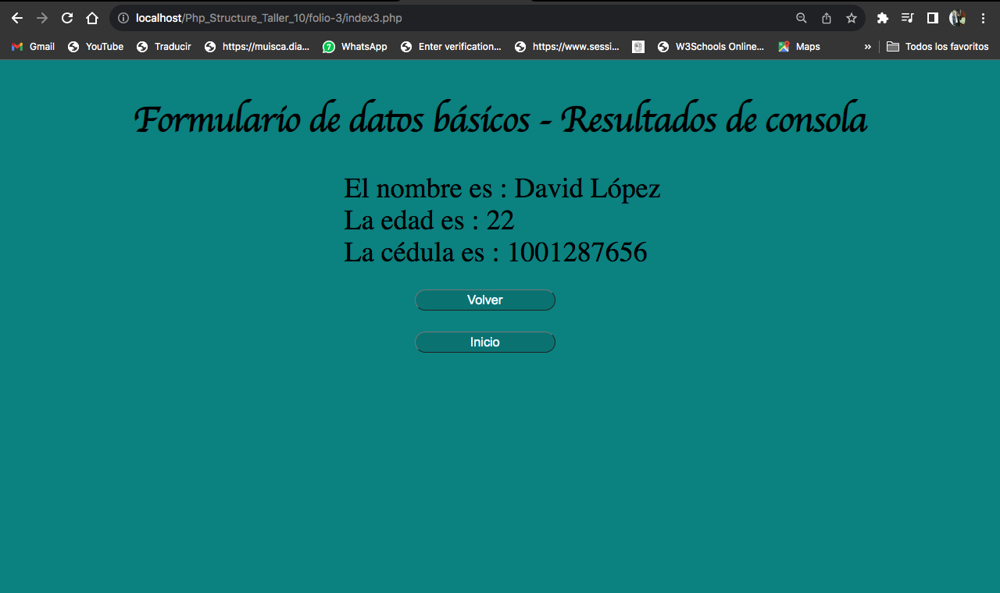</img>  

<h3>Punto 4 : Validacion de fechas digitadas por el usuario</h3>
<a href="./folio-4/indexv4.php">Punto 4 : Validacion de fechas digitadas por el usuario</a>  
<h3>Imágen de la interfaz de cálculo de fechas</h3>
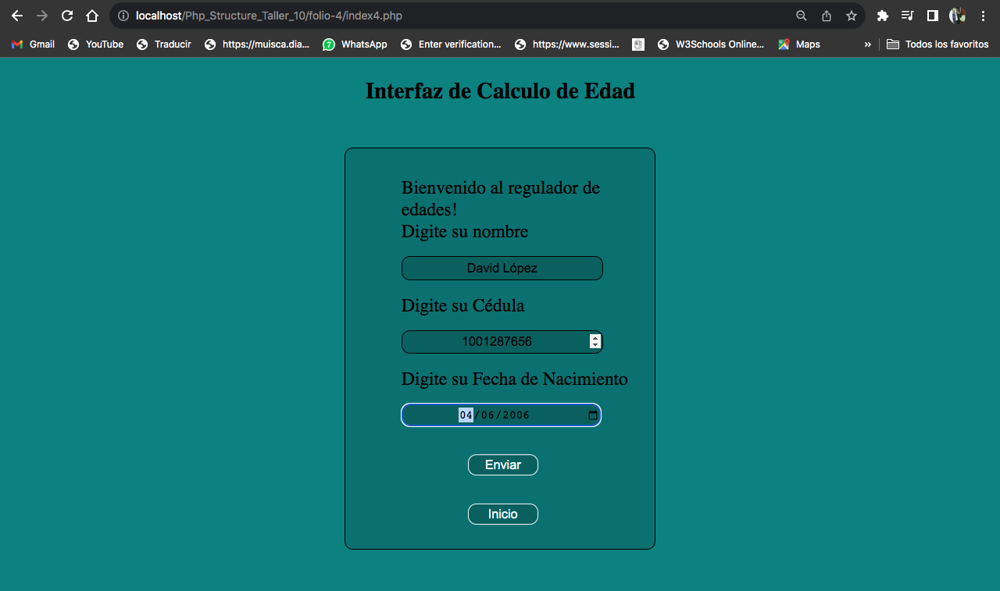</img>  
<h3>Resultado de la interfaz de cálculo de fechas</h3>
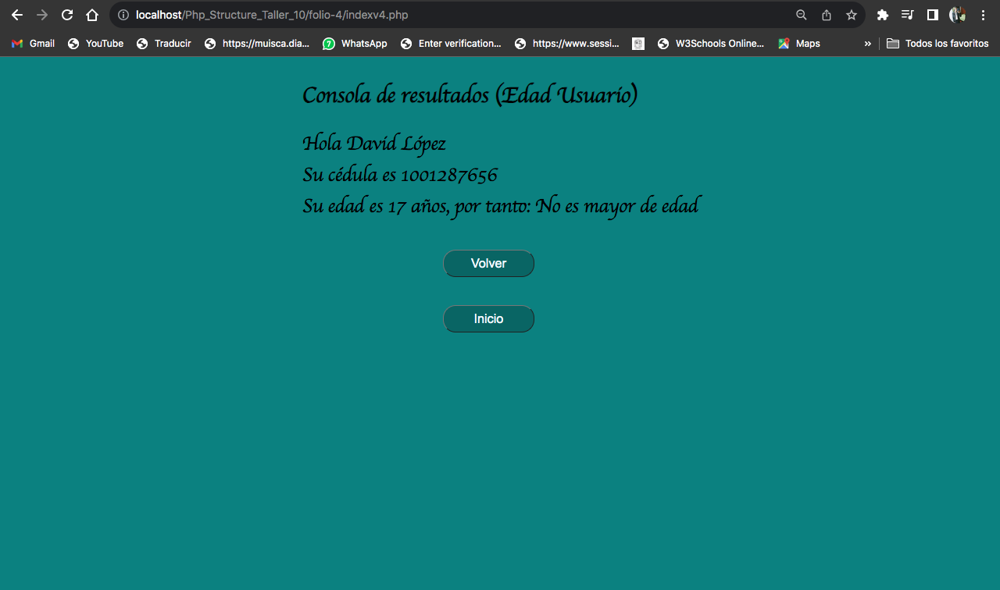</img>  

<h3>Punto 5 : Creación de base de datos mi_proyecto</h3>
<h3>Imágen de la Base de datos</h3>
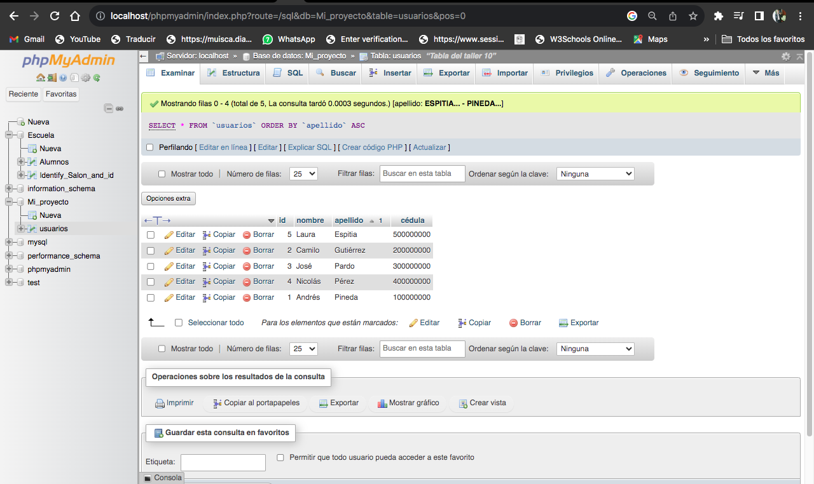</img>  
<h3>Imágen de la estructura de la Base de datos</h3>
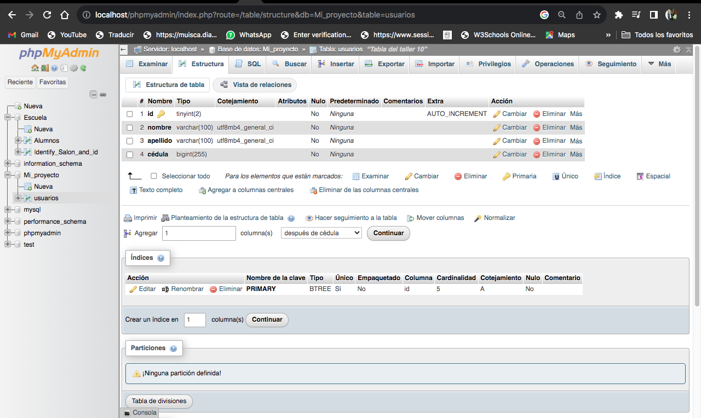</img>  

<h3>Punto 6 : Conexión con base de datos</h3>
 
<h3>Imágen de la conexión de la base de datos</h3>
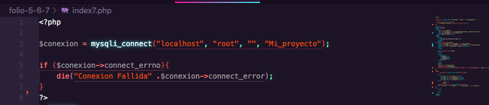</img>  

<h3>Punto 7 : Programa para consultas por filtro Input</h3>
<h3>Imágen de la Base de datos por metodo GET</h3>
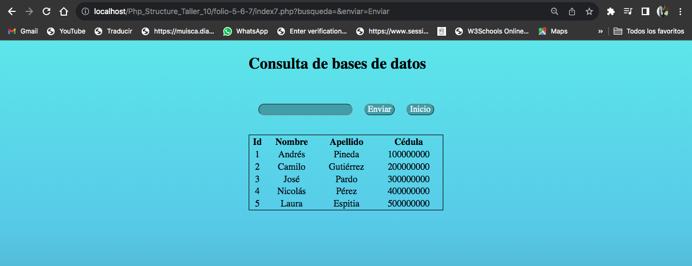</img>  
<h3>Resultado de la consulta de Base de datos por metodo GET</h3>
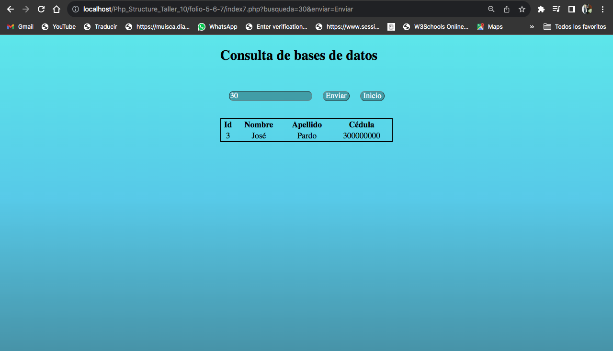</img>  

</main>

<footer>
<h3>Thanks...</h3>
</footer>

</Body>